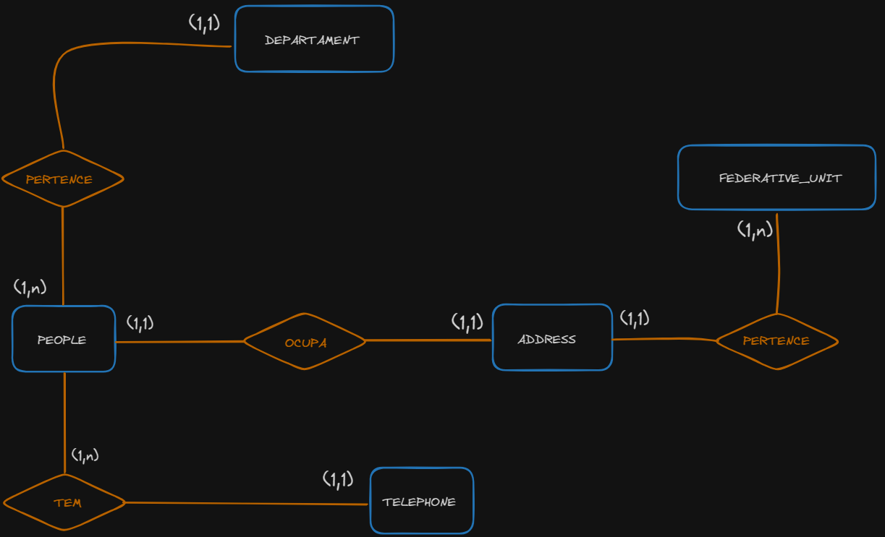

# caseBackEnd
### Desenvolvimento

1. People:

* Representa as informações de uma pessoa.
Possui campos como ``first_name, last_name, cpf, marital_status, email, e birth_date``.
* Tem relacionamentos com outras entidades, como `` departament, telephone, e address ``usando chaves estrangeiras.

2. Departament:

* Representa informações sobre um departamento.
* Possui campos como ``name_departament ``e ``employees`` (o número de funcionários).
* Está relacionado com pessoas (funcionários do departamento) usando o relacionamento people.

3. Address:

* Representa informações sobre endereços.
* Possui campos como ``public_place`` e ``neighborhood``.
* Está relacionado com pessoas usando o relacionamento people e com FederativeUnit usando a chave estrangeira ``federative_unit_id``.

4. Telephone

* Representa informações sobre números de telefone.
* Possui campos como ``personal_phone`` e ``home_phone``.
* Está relacionado com pessoas usando o relacionamento people.

5. FederativeUnit
* Representa unidades federativas (por exemplo, estados em um país).
* Possui um campo ``name_state`` que pode representar a sigla do estado.
* Está relacionado com endereços usando o relacionamento address.



## API

O desenvolvimento da API baseado em python foi utilizado ```Flask, Postgres, Docker```.

 ```
 !! 🚨 Importante ter instalado o Docker na máquina 
 ```

* [Docker Donwload](https://www.docker.com/products/docker-desktop/)

* Clone o projeto ``git clone https://github.com/juevas0101/caseBackEndTechLabs``

__Inicializando rode os comandos a seguir:__

1.  __Ative o ambiente virtual__
```
python -m venv venv

Windows: .\venv\Scripts\Activate.ps1

Mac/Linux: source venv/bin/activate
```

2. __Instale os requerimentos do projeto__ 
```
pip install -r requirements.txt
```

3. __Rode o conatiner__

   [DBeaver ADM SQL](https://dbeaver.io/download/)
```
docker-compose up -d

** caso deseje use uma ferramenta de adm de banco para conectar
```

4. __Inicaliza o Flask__
```
"Inicialize na raiz do projeto .env já foi definido"
flask run

flask db init
flask db migrate
flask dd upgrade

novamente:
flask run
```

⭐ __Agora está conectado !__

__ABAIXO ROTAS:__
```
FEDERATIVE UNIT
POST / GET = http://127.0.0.1:5000/federative_unit

PUT / PATCH/ DELETE = http://127.0.0.1:5000/federative_unit/<int:id>
```
```
ADDRESS
POST / GET = http://127.0.0.1:5000/address

PUT / PATCH/ DELETE = http://127.0.0.1:5000/address/<int:id>
```
```
TELEPHONE
POST / GET = http://127.0.0.1:5000/telephone

PUT / PATCH/ DELETE = http://127.0.0.1:5000/telephone/<int:id>
```
```
DEPARTAMENT

POST / GET = http://127.0.0.1:5000/departament

PUT / PATCH/ DELETE = http://127.0.0.1:5000/departament/<int:id>
```

```
PEOPLE

POST / GET = http://127.0.0.1:5000/people

PUT / PATCH/ DELETE = http://127.0.0.1:5000/people/<int:id>
```
